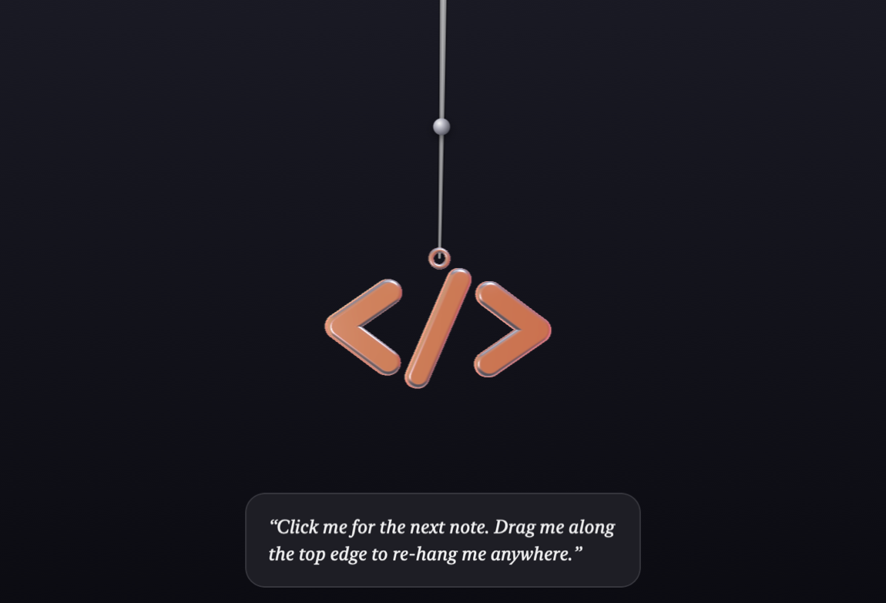

# Dangle

<p align="center">
  
</p>

<p align="center">
  <a href="https://github.com/Melvin0070/dangle/actions/workflows/ci.yml"></a>
  <a href="LICENSE"></a>
  
</p>

A tiny macOS menu bar app that hangs a charm on a thread from the top of your
screen. It sways in an idle breeze, leans away from a passing cursor, swings
properly when grabbed or flicked — and everything except the charm itself
clicks straight through.

Dangle is an open-source *engine*: the charm, the thread, and the notes it
shows all come from data. Three charms ship with the app — `</>`, Heart, and
Four-Leaf Clover — and pick up whatever's published after that from the menu
bar, no app update needed. Drop a `pack.json` in to make it yours.

Inspired by (and in admiration of) Karthik Mahadevan's
[Lucky Dangle](https://luckydangle.app) and Vercel's
[interactive 3D event badge](https://vercel.com/blog/building-an-interactive-3d-event-badge-with-react-three-fiber).
Independent implementation, no artwork or assets reused. If you want lovingly
crafted lucky charms with real rituals and stories, go buy Lucky Dangle.

## Install

Download the latest `Dangle.dmg` from
[Releases](https://github.com/Melvin0070/dangle/releases), drag Dangle to
Applications, then **right-click → Open** the first time (builds are
ad-hoc signed, not notarized). Or build it yourself:

```bash
git clone https://github.com/Melvin0070/dangle.git
cd dangle
make run
```

Requires macOS 14+. Building needs only the Xcode Command Line Tools.

## Features

- **Real physics** — a 12-point verlet rope stepped at a fixed 120Hz with
  render interpolation, idle wind, cursor repulsion scaled to the charm's
  size, drag, flick, stretch, and a velocity-driven 3D turn.
- **A real 3D charm** — the `</>` is extruded SceneKit geometry (chunky
  rounded capsules, dark chrome, gradient environment reflections, HDR bloom)
  that banks and turns as it swings, in a view sized to its own swing so any
  shape hangs — tall, square, or wide. A chrome bead rides the thread partway
  up; for the 2D charm kinds it becomes a tiny twin of the charm.
- **Charms arrive as data** — including their *shapes*: a charm can carry an
  SVG path and be extruded from it, so a new 3D charm is a JSON file, not an
  app release. `</>`, Heart, and Four-Leaf Clover ship with the app. Whatever's published
  after that to this repository's [`charms/`](charms/) catalog installs from
  **Charm → Get New Charms…**. Or hang any emoji.
- **Stays out of the way** — no Dock icon, no windows. Only the charm catches
  your cursor; every other pixel clicks through.
- **Re-hang anywhere** — drag the charm along the top edge.
- **Notes** — click the charm and a native-vibrancy note springs in beneath
  it for a few seconds: just the words, nothing else. Notes can also appear
  on a timer. Catalog charms carry their own (heart and clover each speak
  for themselves); switch back to **Pack Charm** for the pack's.
- **Summon and dismiss** — ⌃⌥D drops it in and lifts it away; ⌃⌥N shows the
  next note; ⌃⌥B blesses the moment. All three remappable per pack.
- **The bless ritual** — `open "dangle://bless"`: one confetti pop from
  behind the charm — a port of
  [canvas-confetti](https://github.com/catdad/canvas-confetti)'s particle
  physics (ISC, Kiril Vatev): pop, decay, wobble, flutter. Wire it into a
  deploy script or git hook.
- **Scriptable** — `open "dangle://note?text=Ship%20it"` shows any message
  from any tool.
- **Behind-windows mode** and **Launch at Login** from the menu bar.
- **Native and light** — AppKit + Core Animation, zero dependencies, no
  Electron, no WebView.

## Performance

Measured on an Apple silicon MacBook (Air 15", release build), as CPU-time
deltas over wall time:

| State | CPU (one core) |
| --- | --- |
| Dismissed, or screen asleep | 0% (display link paused) |
| Dangling, including the idle breeze | **~12%** |
| Confetti bursts + notes | a little higher, while it lasts |

The charm renders at full rate — 120Hz physics, live SceneKit — the entire
time it's on screen, idle breeze included, so there's no step-down and no
stutter. It fully sleeps (0%) only once dismissed and off-screen. That
trade — CPU for a charm that never stutters — is deliberate: nobody keeps a
charm animating on their screen for eight hours straight. The engine still
pauses the display link entirely on dismiss and skips SceneKit writes below
the visible-change threshold. The 30Hz idle-rate toggle
(`DangleEngine.tick`'s `setLinkRate` call) is a one-line flip back to
`active: charmActiveNow || mouseNearCharm` if idle CPU ever needs trimming;
the activity-gated sleep-to-a-bitmap-while-idle behavior was fully removed
rather than flagged off, so bringing that back specifically means re-adding
real logic to `render()`, not flipping a switch.

## Charms

Three charms ship with the app — **`</>`**, **Heart**, and **Four-Leaf
Clover** — installed at first launch, no network fetch required. They're
equal citizens in the Charm menu; none of them is more "default" than the
others. Whatever gets published to the [catalog](charms/index.json) after
that installs from **Charm → Get New Charms…**, no app release needed.
**Charm → Pick an Emoji…** hangs any emoji instead.

A charm is a small JSON file, with its own notes if it wants them:

```json
{
  "id": "heart",
  "name": "Heart",
  "charm": {
    "kind": "glyph3d",
    "glyph": "heart",
    "size": 96,
    "gradientHexes": ["#C81E3C", "#FF5E78", "#FFB3C1"],
    "accentHex": "#C81E3C",
    "menuGlyph": "❤️"
  },
  "notes": ["A little more love in the room today."]
}
```

Want to make one? See [docs/making-charms.md](docs/making-charms.md) — PRs
that add charms to the catalog are very welcome.

## Packs

A pack is one JSON file that fully describes what hangs from the screen and
what it says: charm, thread, notes, hotkeys, timings. Choose **Edit Pack…**
from the menu bar icon, edit, then **Reload Pack** — no rebuild needed.

Full schema and examples in [docs/packs.md](docs/packs.md). `make gift
PACK=path/to/pack.json` builds `dist/Dangle.dmg` with a pack baked in.

## URL scheme

| URL | Effect |
| --- | --- |
| `dangle://bless` | Summon if hidden, then one confetti pop |
| `dangle://note` | Show the next note (the active charm's, or the pack's) |
| `dangle://note?text=…` | Show a custom note |
| `dangle://charm?id=heart` | Hang an installed charm |
| `dangle://charm?glyph=🍀` | Hang that emoji |
| `dangle://charm` | Back to the pack's charm |
| `dangle://toggle` | Summon or dismiss |
| `dangle://summon` / `dangle://dismiss` | Explicit forms |
| `dangle://debug` | Dump loop state to `/tmp/dangle-debug.txt` for bug reports |

## Repository layout

- [`Sources/DangleKit`](Sources/DangleKit) — the engine: physics
  ([`VerletRope`](Sources/DangleKit/VerletRope.swift)), windowing, charm and
  note rendering, packs, the charm store, hotkeys.
- [`Sources/DangleApp`](Sources/DangleApp) — the menu bar shell.
- [`Sources/DangleSnapshot`](Sources/DangleSnapshot) — renders a pack's
  charm, note, and a mid-swing scene to PNGs, plus the app icon
  (`make icon`) and physics diagnostics (`--windstats`).
- [`Tests/DangleKitTests`](Tests/DangleKitTests) — physics invariants, pack
  and charm decoding, hotkey parsing (`make test`).
- [`Packs/`](Packs) — `default/` ships in the app; `local/` (gitignored) is
  where your own packs go.
- [`charms/`](charms) — the published charm catalog.

## Contributing

`make test` runs the suite, `make run` builds and launches, `make snapshot`
renders the visuals for eyeballing changes. See
[CONTRIBUTING.md](CONTRIBUTING.md).

## License

[MIT](LICENSE)
